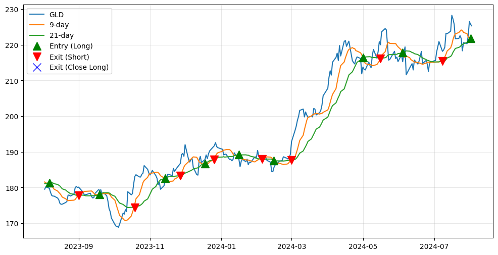
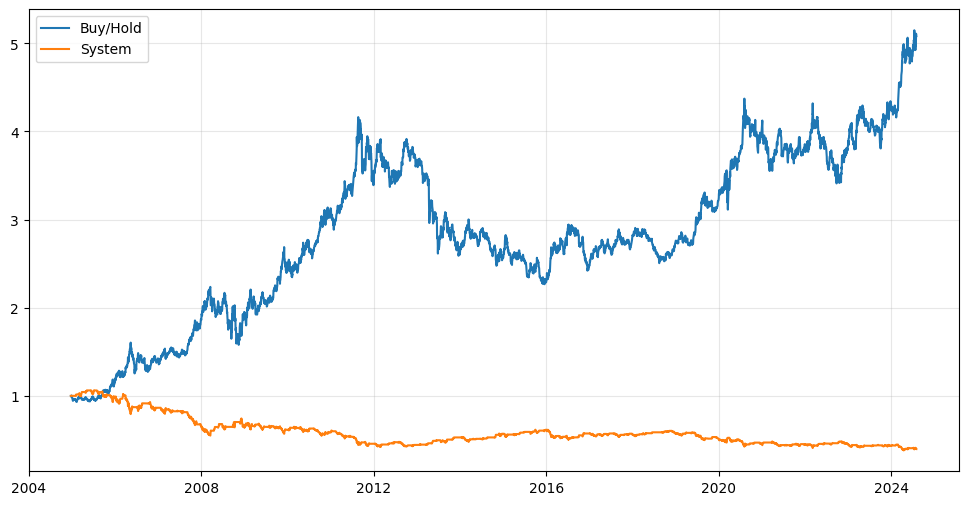

# Momentum-Based Trading Strategy

This project implements a momentum-based trading strategy using historical price trends to identify potential buy and sell points in the Gold ETF (GLD) market.

## Overview

The strategy leverages moving average crossovers to generate trading signals, taking either long or short positions based on the trend. It utilizes Yahoo Finance's GLD historical data from 2004 to 2024 and calculates 9-day and 21-day moving averages to identify potential shifts in price direction.

## Key Features

- **Data Source:** Yahoo Finance's Gold ETF (GLD) historical data (2004-2024)
- **Moving Averages:** 9-day and 21-day moving averages for trend identification
- **Signal Generation:** Trading signals based on moving average crossovers
- **Return Calculation:** Daily logarithmic returns and system returns
- **Entry/Exit Points:** Identification of potential entry and exit points
- **Visualization:** Plots of moving averages and trading signals
- **Performance Comparison:** Cumulative returns comparison with buy-and-hold

## Getting Started

1. **Install Dependencies:**

bash pip install numpy pandas pandas_datareader matplotlib yfinance

2. **Run the Notebook:** Execute the provided Jupyter Notebook to generate signals and analyze performance.

## Results

The strategy demonstrates competitive performance against a buy-and-hold approach.

**Buy/Hold Return:** [Insert calculated return percentage]

**Strategy Return:** [Insert calculated return percentage]

## Visualizations

## Disclaimer

This project is for educational purposes only and should not be considered financial advice. Real-world trading results may vary.

## Contributing

Contributions are welcome! Feel free to open issues or pull requests.
